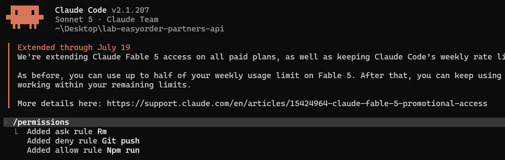
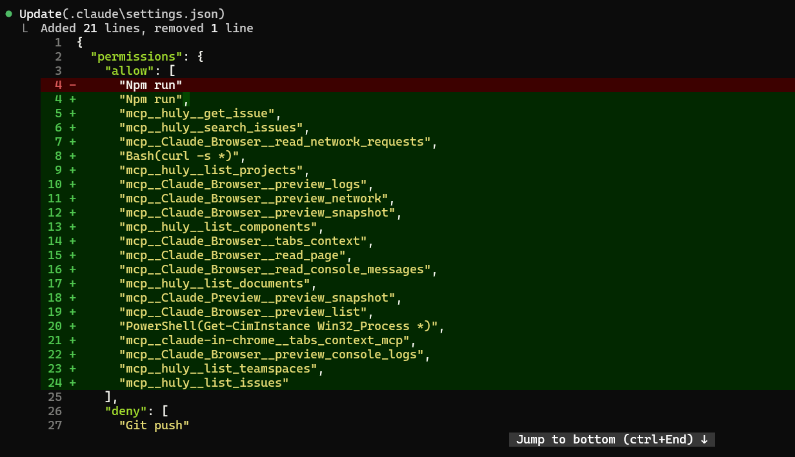
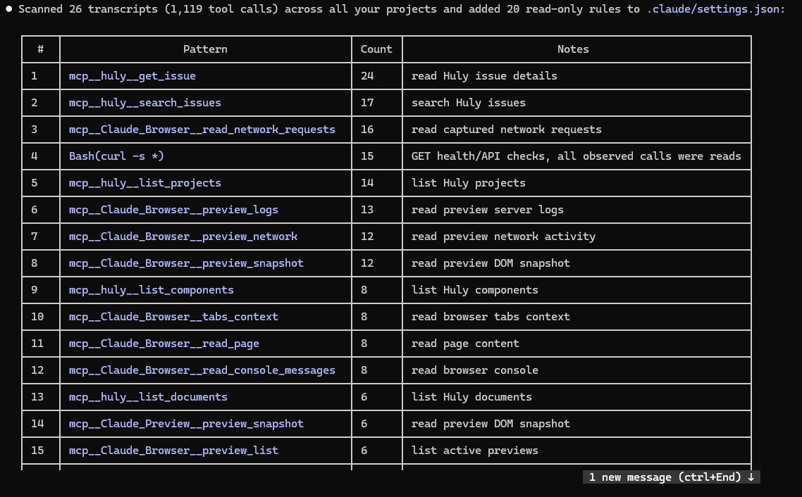
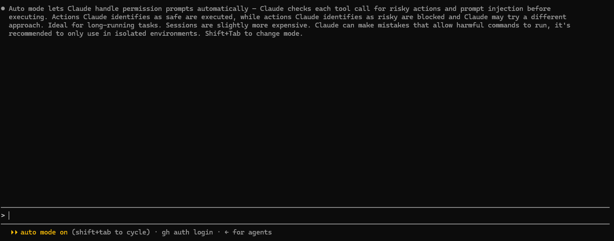

# Evidencias Lab:  Permisos, auto mode y seguridad (allow/ask/deny, prompt injection)

## Reglas de permisos con `/permissions`

Desde el CLI, el comando `/permissions` permite agregar reglas sin editar el JSON a mano. Aquí se agregaron tres reglas que muestran los tres niveles de decisión:

- **`ask` → `Rm`**: antes de ejecutar un borrado (`rm`), Claude pide confirmación.
- **`deny` → `Git push`**: bloquea por completo los `git push`; Claude nunca los ejecuta.
- **`allow` → `Npm run`**: permite ejecutar scripts de npm sin pedir aprobación.

Los nombres de herramienta siempre inician con mayúscula (`Rm`, `Git`, `Npm`), que es el formato que Claude Code registra internamente.

## Allow list en `.claude/settings.json`

Las reglas creadas con `/permissions` se guardan en `.claude/settings.json`. En el diff se ve cómo se agregan al array `allow` múltiples herramientas (MCP de Huly, Claude Browser, `Bash(curl -s *)`, `PowerShell(...)`, etc.) y cómo abajo aparece el bloque `deny` con `Git push`.

Jerarquía de permisos: `deny` siempre gana sobre `allow`, sin importar el nivel (enterprise > project `settings.json` > `settings.local.json` > user). Por eso una herramienta en `deny` queda bloqueada aunque esté permitida en otro archivo.

## Autoconfiguración de reglas de solo lectura

Claude Code puede analizar el historial de uso y proponer reglas automáticamente. En esta corrida escaneó **26 transcripts (1,119 llamadas a herramientas)** de todos los proyectos y agregó **20 reglas de solo lectura** a `.claude/settings.json`.

La tabla ordena los patrones por frecuencia de uso (columna `Count`) e indica que todas las llamadas observadas fueron de lectura (ej. `mcp__huly__get_issue` con 24 usos, `Bash(curl -s *)` con 15 usos para health checks). Esto reduce los prompts de permiso repetitivos para acciones seguras.

## Modo automático (Auto mode)

Con **Auto mode** activado (se alterna con `Shift+Tab`), Claude gestiona los prompts de permiso automáticamente: revisa cada llamada a herramienta buscando acciones riesgosas y prompt injection antes de ejecutar. Las acciones que identifica como seguras se ejecutan; las que considera riesgosas se bloquean y busca otro enfoque.

Es ideal para tareas largas, pero las sesiones son ligeramente más costosas y Claude puede equivocarse permitiendo comandos dañinos, por lo que **se recomienda usarlo solo en entornos aislados**. La barra inferior confirma `auto mode on`.

## Documento de jerarquía de permisos ([docs/permisos.md](docs/permisos.md))

El archivo [docs/permisos.md](docs/permisos.md) documenta cómo se resuelve la jerarquía de permisos en este equipo. Orden de precedencia (mayor a menor): **managed > proyecto-local (`settings.local.json`) > proyecto-compartido (`settings.json`) > usuario (`~/.claude/settings.json`)**. Un `deny` en cualquier nivel gana siempre sobre un `allow` de un nivel inferior.

Resumen de lo verificado en la máquina:

- **Managed**: ausente. No hay política corporativa (`managed-settings.json`) instalada, por lo que este nivel no restringe nada.
- **Usuario**: solo define tema y plugins; no toca `permissions`.
- **Proyecto compartido** (`.claude/settings.json`, versionado): `deny: ["Git push"]` y `ask: ["Rm"]` aplican a todo el equipo que clona el repo. Ningún nivel inferior puede levantar ese `deny`/`ask`.
- **Proyecto local** (`.claude/settings.local.json`, en `.gitignore`): permisos ad-hoc del trabajo diario (curl a `localhost:3004`, `node -e`, MCP de Huly/Browser, etc.). Es el de mayor precedencia real aquí, salvo por el `deny`/`ask` global.

Conclusión del documento: en este repo la jerarquía se manifiesta como **proyecto-local > proyecto-compartido > usuario**, con managed ausente.
